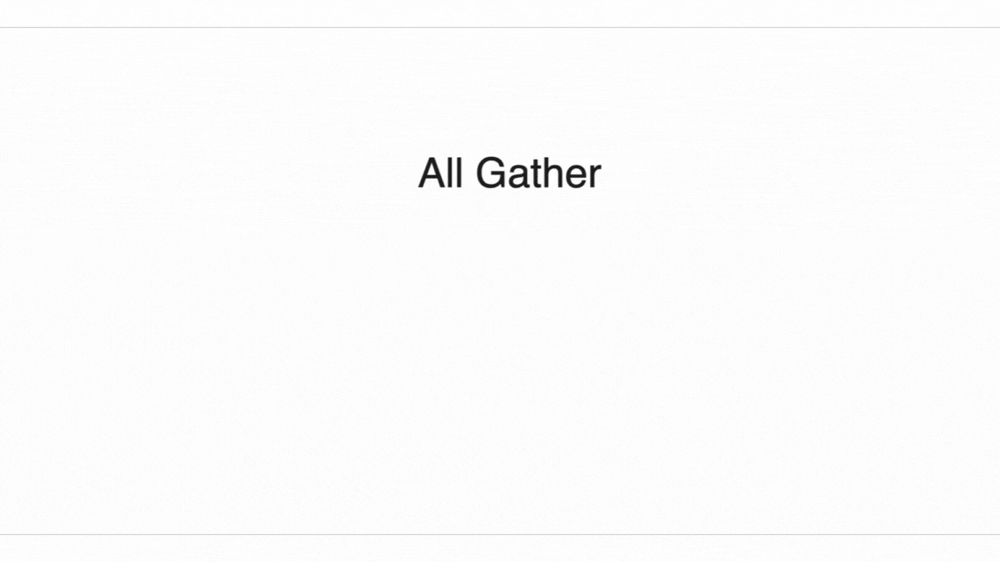
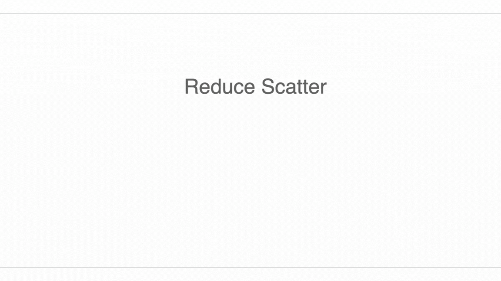
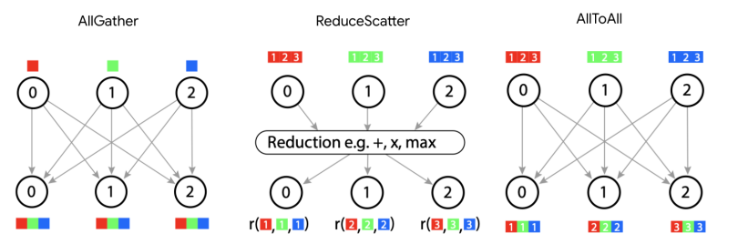
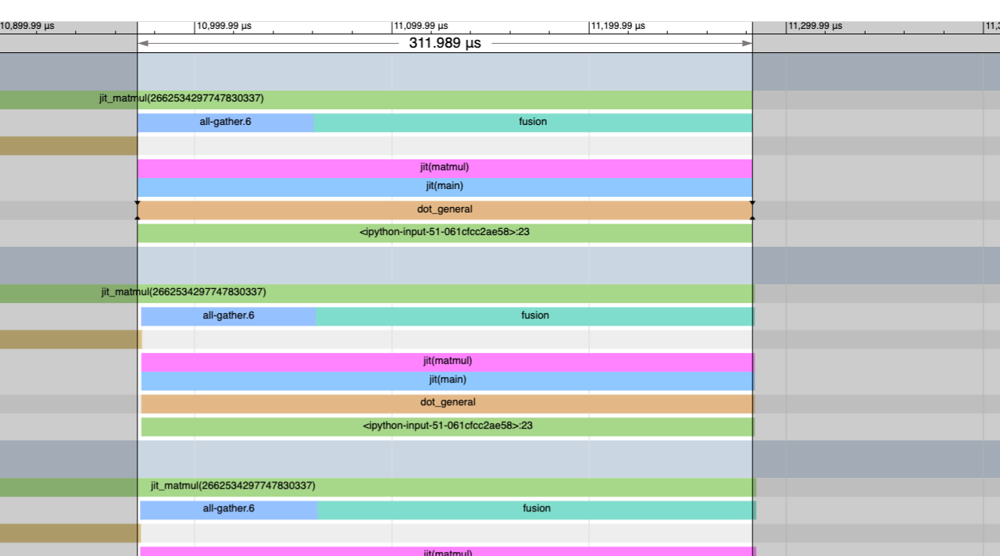
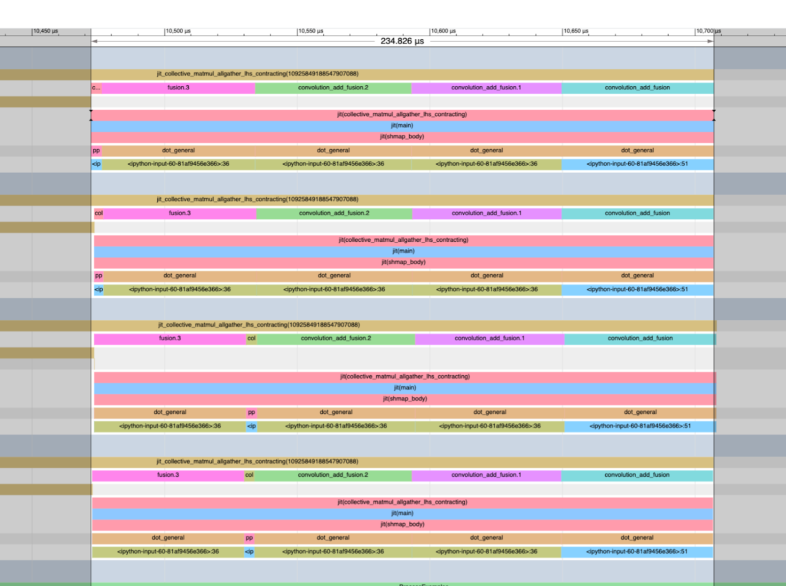

> **本章目标**：先把分布式计算里的通信"积木"讲清楚：AllReduce、AllGather、ReduceScatter、AllToAll 分别做什么，以及它们的时间开销如何估算。下一章再把这些积木组合成分片矩阵乘法。
>
> **对应原书**：[Chapter 3 (Sharded Matrices)](https://jax-ml.github.io/scaling-book/sharding) 上篇：通信原语
> **优先级**：⭐⭐⭐ 高 | **建议时间**：Day 4, 约 2 小时

---

## 5.1 为什么需要集合通信

> 🔗 **与你的联系**
>
> 你做 CV 分布式训练时一定用过 Data Parallel：每张卡有完整的模型副本，各自算梯度，然后做一次 **AllReduce** 把梯度求平均。这个 AllReduce 就是最简单的集合通信原语。
>
> LLM 训练中，由于模型太大无法放在单卡上，需要更多种类的通信：切分权重后要 AllGather 拼回来，切分激活值后要 ReduceScatter 合并结果。理解这些原语是理解所有并行策略的基础。

> 本章刻意不展开"矩阵乘法的四种分片 Case"。如果你看到 `A[I_X, J]` 这类记号，只需要把它理解成"张量某个维度被切到设备轴 X 上"；第 6 章会专门解释这些分片如何影响 matmul。
>
> 📋 **背景知识：MPI 与分布式计算**
>
> **MPI**（Message Passing Interface）是分布式计算的标准通信接口，定义了 AllGather、AllReduce 等集合通信的语义。NCCL、Gloo、XLA 的分布式通信都遵循 MPI 定义的语义。
>
> 关键概念：
> - **进程 vs 线程**：分布式训练中每个 GPU/TPU 对应一个独立**进程**（有自己的内存空间），进程间通过**消息传递**通信。这与单机多线程（共享内存）不同。
> - **Rank**：每个进程在通信组中的唯一编号（0 到 N-1）
> - **World Size**：参与通信的总进程数（= 总 GPU/TPU 数）
> - **通信组（Communicator）**：一组可以互相通信的进程。可以创建子组（如节点内、跨节点分别通信）
> - **集合通信 vs 点对点通信**：集合通信是所有进程同步参与的操作（如 AllReduce）；点对点通信是两个特定进程间的发送/接收（如 PP 中的激活传递）
>
> ```python
> # PyTorch 中初始化分布式进程组的典型代码
> import torch.distributed as dist
> dist.init_process_group(backend="nccl")  # GPU 用 NCCL
> rank = dist.get_rank()          # 当前进程编号
> world_size = dist.get_world_size()  # 总进程数
> ```

### 从四个基础动作开始

在进入 AllGather / ReduceScatter / AllReduce / AllToAll 之前，可以先把集合通信拆成四个更基础的动作：

这部分也可以参考这篇中文长文：[《大模型分布式训练通信原语及其应用》](https://zhuanlan.zhihu.com/p/2013649391051896797)，里面对通信域、rank 和基础通信动作的铺垫更细。

| 基础动作 | 直觉 | 例子 |
|----------|------|------|
| **Broadcast** | 一个 rank 把同一份数据发给所有 rank | rank 0 发布初始化参数 |
| **Reduce** | 多个 rank 的数据按规则合并到一个 rank | 所有梯度求和到 rank 0 |
| **Scatter** | 一个 rank 把一份大数据切开，分发给多个 rank | 把 batch 切给不同 GPU |
| **Gather** | 多个 rank 各自的数据收集到一个 rank | 收集每个 GPU 的局部结果 |

本章讨论的四个核心原语，可以看作这些基础动作的分布式增强版：

- **AllGather** = 语义上等价于 Gather + Broadcast：先把所有 shard 收集成完整张量，再让每个 rank 都拿到完整结果
- **AllReduce** = Reduce 之后再 Broadcast，或者更高效地看成 ReduceScatter + AllGather
- **ReduceScatter** = Reduce 的同时把结果 Scatter，最后每个 rank 只保留一片
- **AllToAll** = 每个 rank 都做一次 Scatter，同时也从所有 rank 收到一片

这里的 `All` 很重要：它表示通信结束后**所有参与者**都得到某种结果，而不是只有单个 root rank 得到结果。理解这个区别后，后面的 `V/W` 成本公式会更容易读。

---

## 5.2 环形算法：集合通信的基础

在理解具体原语之前，先理解它们共同的底层机制——**环形算法**（Ring Algorithm）。

### 为什么用环形

TPU 在 Torus 拓扑中天然形成环。GPU 虽然通过 NVSwitch 全互联，但 NCCL 也常用环形算法来实现集合通信（简单、高效、容易扩展）。

### 单向环 vs 双向环

**单向环**：数据只沿一个方向传递，每个分片需要 $N-1$ 跳到达所有设备。

```
N=4 设备的单向 AllGather（3 轮通信）：

初始：  D0=[A]  D1=[B]  D2=[C]  D3=[D]

Step 1: D0=[A,D] D1=[B,A] D2=[C,B] D3=[D,C]   (每设备向右传一份)
Step 2: D0=[A,D,C] D1=[B,A,D] D2=[C,B,A] D3=[D,C,B]
Step 3: D0=[A,B,C,D] D1=[A,B,C,D] D2=[A,B,C,D] D3=[A,B,C,D] ✓
```

**双向环**（TPU 有 wraparound 时）：数据同时向两个方向传递，只需 $\lfloor N/2 \rfloor$ 跳。

```
N=4 设备的双向 AllGather（2 步）：

初始：  D0=[A]  D1=[B]  D2=[C]  D3=[D]

Step 1: D0=[A,D,B]  D1=[B,A,C]  D2=[C,B,D]  D3=[D,C,A]  (向左+向右)
Step 2: D0=[A,B,C,D] D1=[A,B,C,D] D2=[A,B,C,D] D3=[A,B,C,D] ✓
```

### 通信时间推导

设数组总大小为 $V$ 字节，分片在 $X$ 个设备上。

为了避免后面的公式混乱，先统一两个口径：

- $V$：**一次集合通信的逻辑 payload 大小**。例如 AllGather `A[I_X, J] -> A[I, J]` 中，$V$ 指完整张量 $A[I,J]$ 的字节数；AllReduce 中，$V$ 指每个设备参与归约的本地 buffer 字节数。
- $W_{\text{uni}}$：单向链路带宽；$W_{\text{bi}} = 2W_{\text{uni}}$ 表示两个方向同时传输时的聚合带宽。本文的双向环公式默认使用 $W_{\text{bi}}$。

**双向环 AllGather**：每跳传输 $2V/X$ 字节（两个方向各 $V/X$），需要 $X/2$ 跳。总时间：

$$T = \frac{X}{2} \times \frac{2V}{X \times W_{\text{bi}}} = \frac{V}{W_{\text{bi}}}$$

其中 $W_{\text{bi}}$ 是双向聚合带宽。关键结论：**时间与设备数 $X$ 无关**！只取决于数据总量和链路带宽。

这之所以成立，是因为虽然跳数随 $X$ 增加，但每跳传输的数据量随 $X$ 减少，两者恰好抵消。

---

## 5.3 四种核心通信原语

假设有 N 个设备，每个设备持有一份数据。

### AllGather

**功能**：每个设备持有一个分片，通信后每个设备拥有**完整数据**。用分片记号表示：

$$\textbf{AllGather}_X(A[I_X, J]) \to A[I, J]$$

即"移除下标"——将沿 $X$ 轴分片的数据收集到所有设备上。

从语义上看，AllGather 可以理解成 **Gather + Broadcast**：先把所有设备的 shard 收集成完整张量，再把完整张量发给所有设备。但高性能实现通常不会真的经过单个 root rank，因为那会让 root 的入口/出口带宽成为瓶颈；实际系统会用 ring、tree 或 recursive doubling 等算法，让所有设备并行收发。



```
通信前：设备0=[A], 设备1=[B], 设备2=[C], 设备3=[D]
通信后：设备0=[A,B,C,D], 设备1=[A,B,C,D], ...（每个设备都有全部）
```

- **通信量**：每设备发送自己的分片（大小 $V/N$），接收其余 $N-1$ 个分片
- **总字节/设备**：发送 $V \times (N-1)/N \approx V$
- **时间**（带宽限制）：$T = V / W_{\text{bi}}$（与 $N$ 无关！）
- **用途**：让每个设备从"只持有一个 shard"变成"拥有完整张量"。典型场景包括 FSDP 中计算前恢复完整权重；第 6 章会看到它也常用于修复某些分片 matmul 的输入布局

### ReduceScatter

**功能**：每个设备持有完整数据（但各设备的值不同，需要归约），通信后每个设备持有**归约后的一个分片**。用分片记号表示：

$$\textbf{ReduceScatter}_{X,J}(A[I, J] \{U_X\}) \to A[I, J_X]$$

即"移除 $\{U_X\}$（未归约标记），添加下标"——先求和再分片。



```
通信前：设备0=[a₀,a₁,a₂,a₃], 设备1=[b₀,b₁,b₂,b₃], ...
通信后：设备0=[a₀+b₀+c₀+d₀], 设备1=[a₁+b₁+c₁+d₁], ...
```

- **通信量和时间**：与 AllGather 相同（$T = V / W_{\text{bi}}$）
- **用途**：把多个设备上的部分结果求和，并保持分片形态。典型场景包括 DP/FSDP 中归约梯度；第 6 章会看到它也常用于保留分片输出，避免再做一次 AllGather
- **维度选择的自由度**：ReduceScatter 引入一个新的分片维度，可以选择沿哪个逻辑维度分片。例如 $C[I, K] \{U_X\}$ 可以归约为 $C[I_X, K]$ 或 $C[I, K_X]$，具体选择由后续计算需求决定

**ReduceScatter 与 AllGather 的对偶关系**：

这两个操作互为**转置**（也是互为反向传播的导数）：
- 前向用 AllGather → 反向用 ReduceScatter
- 前向用 ReduceScatter → 反向用 AllGather

这源于广播（broadcast）和归约（reduce）作为线性算子互为转置的数学性质。

### AllReduce

**功能**：每个设备持有一份数据，通信后每个设备拥有**所有设备数据的归约结果**（如总和）。用分片记号表示：

$$\textbf{AllReduce}_X(A[I, J] \{U_X\}) \to A[I, J]$$

即"移除 $\{U_X\}$"——求和后保持完全复制。

> 📋 **背景知识：AllReduce = ReduceScatter + AllGather**
>
> AllReduce 不是一个"基本"操作——它由两步组成：
>
> ```
> 步骤1 (ReduceScatter)：归约 + 分片 → 每设备得到 sum 的 1/N
> 步骤2 (AllGather)：收集所有分片 → 每设备得到完整 sum
> ```
>
> 因此 AllReduce 的通信时间是单次 AllGather/ReduceScatter 的 **2 倍**：
>
> $$T_{\text{AllReduce}} = 2 \times \frac{V}{W_{\text{bi}}}$$

>
> 在 Ring AllReduce 实现中：
> - N 个设备组成环
> - 数据分 N 份，经过 N-1 步传递完成 ReduceScatter
> - 再经过 N-1 步完成 AllGather
> - 总通信量：`2V × (N-1)/N ≈ 2V`
>
> **NCCL 的实际实现**更为复杂：NCCL 会根据消息大小和拓扑自动选择最优算法。小消息用 Tree 算法（$\log N$ 延迟），大消息用 Ring 算法（最大化带宽利用）。

- **用途**：DP 中同步梯度（最经典的用法）；也可以在需要完整复制结果时归约多个设备上的部分和
- **一个常见的优化**：如果后续操作本来就需要分片结果，可以只做 ReduceScatter 而跳过 AllGather，延迟到需要时再 AllGather。这在 FSDP / ZeRO-3 中被广泛使用

### AllToAll

**功能**：每个设备将自己的数据分成 N 份，分别发送给 N 个设备。可以理解为**"将下标从一个维度移到另一个维度"**：

$$\textbf{AllToAll}_{X,J}(A[I_X, J]) \to A[I, J_X]$$


```
通信前：设备0=[A₀,A₁,A₂,A₃], 设备1=[B₀,B₁,B₂,B₃], ...
通信后：设备0=[A₀,B₀,C₀,D₀], 设备1=[A₁,B₁,C₁,D₁], ...
```

**AllToAll 为什么比 AllGather 便宜？** AllGather 中每个分片需要到达**所有**设备；AllToAll 中每个分片只需到达**一个**目标设备。在理想的双向环带宽模型下，AllToAll 的代价约为 AllGather 的 **1/4**：

$$T_{\text{AllToAll}} = \frac{V}{4 \times W_{\text{bi}}}$$

这个结论主要适用于 TPU torus/ring 上的大消息、带宽限制场景。GPU 的 NVSwitch、InfiniBand、NCCL tree/ring 混合算法不一定严格满足这个比例，但“目标从所有设备变成一个设备，所以 AllToAll 通常比 AllGather 少搬很多字节”这个直觉仍然成立。

推导直觉：AllGather 中每个分片平均要跳 $N/2$ 步（环的半径），AllToAll 中每个子分片平均只需跳 $N/4$ 步（因为目标随机分布），再加上 AllToAll 的每个子分片比 AllGather 的分片更小（$V/N^2$ vs $V/N$），两个因素叠加得到 1/4。

> 📋 **背景知识：AllToAll 1/4 代价的严格推导**
>
> 考虑 $N$ 个设备的**单向**环：
> - AllGather：每个分片（$V/N$ 字节）传过 $N-1$ 条链路 → 每条链路总流量 = $V(N-1)/N \approx V$
> - AllToAll：设备 $i$ 要将 $N$ 个子块分别发到 $N$ 个目标。距离为 $k$ 的子块需跳 $k$ 步 → 每设备总流量 = $(V/N^2) \times (1+2+...+(N-1)) = V(N-1)/(2N) \approx V/2$
>
> 单向环上 AllToAll 是 AllGather 的 **1/2**。
>
> 加上**双向**通信：AllGather 获得 2× 加速（可双向传递），AllToAll 获得 **4×** 加速（最远只需传 $N/2$ 而非 $N$，且双向）。
>
> 综合：AllToAll 时间 = AllGather 时间 × $\frac{1/2}{2} = 1/4$

- **用途**：MoE 模型中将 token 路由到不同 expert；Expert Parallelism 中重新分布激活值
- **ND AllToAll**：在 $A \times B \times C$ 的网格上，$T = V \times \max(A,B,C,...) / (4NW_{\text{bi}})$
- **GPU 上的 AllToAll**：节点内全互联，AllToAll 更高效（$T \approx V/(N \times W_{\text{GPU}})$）；跨节点退化严重

### 所有原语一览



| 操作 | 分片记号变换 | 代价（双向环） |
|------|------------|-------------|
| AllGather | $[A_X, B] \to [A, B]$ | $V / W_{\text{bi}}$ |
| ReduceScatter | $[A, B]\{U_X\} \to [A_X, B]$ | $V / W_{\text{bi}}$ |
| AllReduce | $[A, B]\{U_X\} \to [A, B]$ | $2V / W_{\text{bi}}$ |
| AllToAll | $[A, B_X] \to [A_X, B]$ | $V / (4W_{\text{bi}})$ |

---

## 5.4 通信时间的深入分析

### 带宽限制 vs 延迟限制

上面的公式 $T = V/W$ 假设了**带宽限制**（bandwidth-bound）模式——数据量大到传输时间远超固有延迟。但实际中每次 ICI 跳转有约 **1μs** 的固有延迟（不管传多少数据），当数据很小时进入**延迟限制**（latency-bound）模式：

$$T_{\text{hop}} = \max\left(T_{\text{min}},\ \frac{2V}{X \times W_{\text{bi}}}\right)$$

$$T_{\text{total}} = \max\left(\frac{T_{\text{min}} \times X}{2},\ \frac{V}{W_{\text{bi}}}\right)$$

**延迟限制阈值**：在 TPU v5e 上（单向 ICI = $4.5\text{e}10$ B/s），发送任何小于 $4.5\text{e}10 \times 1\text{e-}6 = 45\text{ KB}$ 的缓冲区都会进入延迟限制。

> 💡 **Pop Quiz：带宽限制还是延迟限制？**
>
> 在 TPU v5e 4×4 slice 上 AllGather `bf16[128]`（256 字节），沿轴 4 做。需要多久？
>
> <details markdown="1">
> <summary>点击查看答案</summary>
>
> 每分片 = 256/4 = 64 字节。$64 / 4.5\text{e}10 \approx 0$ → 远小于 1μs → 延迟限制。
>
> TPU v5e 4×4 中轴 4 无 wraparound（需要 16 才有），只能单向传 3 跳 → $T \approx 3\mu s$。
>
> 实测约 8μs（各种开销）。
>
> </details>

### 多轴 AllGather

当数组沿多个轴分片时（如 $A[I_{XY}, J]$），AllGather 可以利用多个 ICI 轴**同时**传输：

$$T_{\text{total}} = \max\left(\frac{T_{\text{min}} \times \sum_i |X_i|}{2},\ \frac{V}{W_{\text{bi}} \times N_{\text{axes}}}\right)$$

多轴带来的好处：
- 带宽限制时：有效带宽乘以轴数（$W_{\text{effective}} = W_{\text{bi}} \times N_{\text{axes}}$）
- 延迟限制时：路径长度为所有轴长度之和

### 在 Torus（TPU）上

TPU v5e（2D，单向 ICI = 45 GB/s/轴）：

$$T_{\text{AG/RS}} = \frac{V}{W_{\text{bi}}} = \frac{V}{90\text{ GB/s}}\ (\text{单轴, 有 wraparound})$$

TPU v5p（3D，单向 ICI = 90 GB/s/轴）：

$$T_{\text{AG/RS}} = \frac{V}{180\text{ GB/s}}\ (\text{单轴}) \quad \text{或} \quad \frac{V}{540\text{ GB/s}}\ (\text{三轴并行})$$

### 在 NVLink（GPU）上

GPU 节点内的集合通信走 NVSwitch 全互联，语义相同但实现不同：

$$T_{\text{AG/RS}}^{\text{intra-node}} = \frac{V \times (N-1)}{N \times W_{\text{GPU}}} \to \frac{V}{W_{\text{GPU}}}$$

H100：$W_{\text{GPU}} = 450$ GB/s；B200：$W_{\text{GPU}} = 900$ GB/s。

跨节点走 InfiniBand：

$$T_{\text{AG/RS}}^{\text{cross-node}} = \frac{V}{W_{\text{node}}} = \frac{V}{400\text{ GB/s}}$$

### 经验带宽测量

理论值和实测值之间有显著差距：

| 平台 | 操作 | 理论带宽 | 实测峰值 | 达峰消息大小 |
|------|------|---------|---------|------------|
| TPU v5e (16轴) | AllGather | 90 GB/s | ~85 GB/s (95%) | ~10 MB（分片 ~625 KB）|
| H100 (8 GPU 节点) | AllReduce | 450 GB/s | ~370 GB/s (82%) | ~10 GB |
| H100 (8 GPU 节点) | AllGather | 450 GB/s | ~400 GB/s (89%) | ~1 GB |

TPU 在更小的消息上就能达到接近峰值带宽（~600 KB vs GPU 的 ~10 MB），这是 TPU 直连低延迟的优势。

---

## 5.5 通信与计算的重叠（概念预告）




关键优化：**在做计算的同时进行通信**。当 $T_{\text{math}} > T_{\text{comms}}$ 时，通信可以被计算掩盖，端到端时间从：

$$T_{\text{total}} = T_{\text{comms}} + T_{\text{math}}$$

变成近似：

$$T_{\text{total}} \approx \max(T_{\text{comms}}, T_{\text{math}}) + T_{\text{startup}}$$

这里的 $T_{\text{startup}}$ 是 pipeline 启动和收尾的额外开销。

### 基本思路


以 AllGather + 计算为例，传统做法是先等通信全部完成，再开始计算：

```
[AllGather: 等待全部完成] → [Compute]
总时间 = T_comms + T_math
```

重叠版本会把数据切成多个 chunk：收到一个 chunk 就立刻计算这个 chunk 对应的部分结果，同时继续接收下一个 chunk：

```
[收到 chunk 0] → [计算 chunk 0]
        [收到 chunk 1] → [计算 chunk 1]
                [收到 chunk 2] → [计算 chunk 2]
                        ...
总时间 ≈ max(T_comms, T_math) + 启动延迟
```

同样的思想也适用于 ReduceScatter / AllReduce：一边产生部分结果，一边把已经完成的 chunk 发送出去。

### 实现条件

通信能被有效掩盖的条件：

$$T_{\text{math}} > T_{\text{comms}} \implies \frac{2BDF}{C} > \frac{V}{W}$$

这本质上就是 Roofline 分析中的 compute-bound 条件。当操作已经是 memory-bound 时，通信无法被掩盖。

> 第 6 章会把这个概念落到分片矩阵乘法上：哪些 matmul 布局需要 AllGather，哪些需要 ReduceScatter/AllReduce，以及如何做 Collective Matmul。

> 🛠️ **实践：Megatron 中的通信重叠**
>
> Megatron 中的核心通信优化配置：
>
> ```bash
> # 梯度 ReduceScatter 与反向传播计算重叠
> --overlap-grad-reduce
>
> # ZeRO-1 中参数 AllGather 与前向计算重叠
> --overlap-param-gather
>
> # Sequence Parallelism：用 AG/RS 替代 AllReduce
> --sequence-parallel
>
> # 分布式优化器（ZeRO-1）
> --use-distributed-optimizer
> ```
>
> **Sequence Parallelism** 的思路：
> - TP 组内，LayerNorm/Dropout 的输入不需要完整副本
> - 将这些操作的激活值沿序列维度分片（ReduceScatter）
> - 下一个 Attention/MLP 之前再 AllGather
> - 效果：每设备只存 1/TP 的激活值 → 激活内存大幅减少

---

## 5.6 NCCL：GPU 集合通信的实现

> 🛠️ **实践：NCCL 内部机制**
>
> **NCCL**（NVIDIA Collective Communication Library，读作 "nickel"）是 GPU 上集合通信的标准实现。
>
> **算法选择**：NCCL 根据消息大小和拓扑自动选择最优算法：
> - **Ring**：大消息（> ~256 KB），最大化带宽利用
> - **Tree**：中等消息，平衡延迟和带宽
> - **Direct/P2P**：小消息或节点内全互联时
>
> **Ring vs Tree 的权衡**：
>
> | | Ring | Tree |
> |--|------|------|
> | 带宽利用 | 最优（100%） | 较低（~50%） |
> | 延迟 | O(N)（N-1 步） | O(log N) |
> | 适用场景 | 大消息 | 小消息、高延迟网络 |
>
> **关键环境变量**：
> ```bash
> NCCL_IB_DISABLE=0          # 启用 InfiniBand
> NCCL_SOCKET_IFNAME=eth0    # 指定网络接口
> NCCL_ALGO=Ring             # 强制使用 Ring 算法
> NCCL_DEBUG=INFO            # 调试输出
> NCCL_P2P_LEVEL=NVL         # NVLink 点对点
> ```
>
> **与 XLA（TPU）的对比**：
> - XLA 的通信由编译器静态调度，不需要运行时决策
> - NCCL 是运行时库，动态选择算法
> - XLA 可以做全局通信调度优化；NCCL 只优化单次集合操作

---

## 5.7 分布式训练中的通信模式

理解了基本原语后，我们来看在实际的分布式训练/推理中，这些原语是如何组合使用的。

### Data Parallelism（DP）

DP 中每个设备持有完整模型副本，独立计算不同 batch 的梯度，然后 **AllReduce** 梯度求平均：

```
前向传播：各设备独立计算（无通信）
反向传播：各设备独立计算梯度（无通信）
梯度同步：AllReduce(gradients) → 所有设备得到平均梯度
参数更新：各设备独立更新（无通信）
```

通信量 = $2 \times \text{模型大小}$（AllReduce = RS + AG）

### ZeRO / FSDP

ZeRO-3 将权重、梯度、优化器状态全部分片。每层需要：
- **前向**：AllGather 权重 → 计算前向 → 丢弃非本地权重
- **反向**：AllGather 权重 → 计算反向 → ReduceScatter 梯度 → 丢弃非本地权重

通信量 = $3 \times \text{模型大小}$（1× AllGather 前向 + 1× AllGather 反向 + 1× RS 梯度）

### Tensor Parallelism（TP）

TP 将权重矩阵沿非收缩维度分片。每层 MLP 需要：
- 前向：AllGather 或 ReduceScatter 激活值（取决于分片方式）
- 反向：反过来的操作

通信量 ∝ **激活值大小**（$B \times D$），远小于权重大小（$D \times F$）。但 TP 的通信**频率很高**（每层都要通信），且不能和计算完全重叠。

### Pipeline Parallelism（PP）

PP 使用 **点对点通信**（Send/Recv），不使用集合通信：

```
Stage 0 → Send(activations) → Stage 1 → Send(activations) → Stage 2
Stage 2 → Send(gradients)   → Stage 1 → Send(gradients)   → Stage 0
```

通信量极小（$\sim B \times D$），但在关键路径上不可重叠。

### Expert Parallelism（EP）

EP 使用 **AllToAll** 重新分布 token：

```
前向：AllToAll(tokens → experts) → 专家计算 → AllToAll(results → 原设备)
反向：对称的 AllToAll 操作
```

通信量 = $4 \times B \times D$（2× 前向 + 2× 反向的 AllToAll）。在理想双向环模型下，AllToAll 代价约为同等 payload AllGather 的 1/4。

### 通信模式总结

| 并行策略 | 使用的原语 | 通信量 | 通信频率 | 可重叠？ |
|---------|----------|--------|---------|---------|
| DP | AllReduce | 2× 模型大小 | 每步 1 次 | 可以（和反向重叠） |
| FSDP | AG + RS | 3× 模型大小 | 每层 3 次 | 部分可以 |
| TP | AG/RS | 激活值大小 | 每层 2 次 | 部分可以 |
| PP | Send/Recv | 激活值大小 | 每 stage 1 次 | 不能 |
| EP | AllToAll | 激活值大小 | 每层 2 次 | 不能 |

> 🛠️ **实践：Mini-SGLang 中的 TP 通信**
>
> 在 mini-sglang 的推理引擎中，TP 的集合通信由 NCCL 实现。
>
> ```python
> # mini-sglang 中 TP 的 AllReduce 调用（简化）
> # 每个 Attention 和 MLP 层的输出需要 AllReduce
> if tp_size > 1:
>     dist.all_reduce(output, op=dist.ReduceOp.SUM, group=tp_group)
> ```
>
> 推理中 TP 的通信量远小于训练：
> - 训练：$B$ = 数千 tokens → 激活值通信量大
> - 推理 decode：$B$ = 1 token → 每次 AllReduce 只有几 KB → **延迟限制**
> - 推理 prefill：$B$ = prompt 长度 → 类似训练
>
> 这也是为什么推理中 TP 的主要好处是**减少每卡权重加载量**（降低 decode 延迟），而非通信效率。

---

## 5.8 通信开销的直觉

一些有用的直觉和具体数值：

**AllReduce 梯度（Data Parallelism）**：
- 通信量 ≈ 2 × 模型参数量（与设备数**无关**！）
- 7B 模型，bf16：通信量 ≈ 2 × 14 GB = 28 GB
- 在 450 GB/s H100 NVLink/NVSwitch 有效带宽上：~62 ms
- 在 50 GB/s InfiniBand 上：~560 ms
- 在 90 GB/s ICI（TPU v5e 单轴双向）上：~311 ms

**AllGather 权重（FSDP / ZeRO-3）**：
- 通信量 ≈ 模型参数量（bf16）
- 7B 模型：~14 GB
- 可以和前向计算重叠 → 如果模型够大，几乎免费

**ReduceScatter 梯度（FSDP / ZeRO-3）**：
- 通信量 ≈ 模型参数量（bf16）
- 可以和反向传播重叠 → 每层计算完反向时立即发送

**AllToAll（MoE Expert Parallelism）**：
- 通信量 = 激活值大小 × $(N-1)/N$
- 在理想双向环上比 AllGather 便宜约 4×，但**通常不能和计算重叠**（必须先收集完才能计算）
- 在 MoE 中需要做 2 次（前向和反向各一次）→ 可能成为瓶颈

**核心数字记忆**（H100 8 GPU 节点，按 450 GB/s 有效带宽估算）：

| 模型大小 | AllReduce 时间 | AllGather 时间 | 说明 |
|---------|-------------|-------------|------|
| 7B | ~62 ms | ~31 ms | 小模型，可完全掩盖 |
| 70B | ~622 ms | ~311 ms | 大模型，需要分层并行 |
| 405B | ~3.6 s | ~1.8 s | 超大模型，必须深度分片 |

---

## 5.9 Worked Problems（习题与详解）

### Problem 1：AllGather 时间计算

**题目**：在 TPU v4p 4×4×4 slice（mesh `{'X': 4, 'Y': 4, 'Z': 4}`）上做以下操作，分别需要多长时间？

(a) $\text{AllGather}_X([B_X, D_Y])$，$B=1024, D=4096$，bf16

(b) $\text{AllGather}_{XY}([B_X, D_Y])$

(c) $\text{AllReduce}_Z([B_X, D_Y]\{U_Z\})$

<details markdown="1">
<summary>点击查看答案</summary>

TPU v4p 双向 ICI = 90 GB/s/轴，4×4×4 是完整 cube，所有轴有 wraparound。

**(a)** 只沿 X 轴 AllGather，数据沿 Y 轴已分片，所以实际传输量 = $2BD/Y = 2 \times 1024 \times 4096 / 4 = 2\text{ MB}$

$T = 2\text{e}6 / 9\text{e}10 = 22\mu s$

延迟检查：X 轴 4 个设备，wraparound → 2 跳 → $2\mu s$ → 不是延迟限制 ✓

**(b)** 沿 XY 两轴 AllGather，数据总量 = $2BD = 2 \times 1024 \times 4096 = 8\text{ MB}$，利用 2 个轴的带宽：

$T = 8\text{e}6 / (2 \times 9\text{e}10) = 44\mu s$

延迟检查：$X+Y = 4+4 = 8$ 的路径，$\sim 4\mu s$ → 不是延迟限制 ✓

**(c)** AllReduce 沿 Z 轴做，但张量已经沿 X、Y 分片。每个设备参与 Z 轴归约的本地 buffer 是：

$$V_{\text{local}} = \frac{2BD}{XY} = \frac{2 \times 1024 \times 4096}{16} = 0.5\text{ MB}$$

AllReduce = ReduceScatter + AllGather，因此：

$$T = \frac{2V_{\text{local}}}{W_{\text{bi}}} = \frac{2 \times 0.5\text{e}6}{9\text{e}10} \approx 11.6\mu s$$

延迟检查：Z 轴 4 个设备，wraparound → 2 跳 → $2\mu s$，仍然是带宽限制。

</details>

### Problem 2：延迟限制场景

**题目**：在 TPU v4p 4×4×4 上 $\text{AllGather}_X([B_X])$，$B=128$，bf16（256 字节）。需要多久？

<details markdown="1">
<summary>点击查看答案</summary>

每分片 = 256/4 = 64 字节。$64 / 4.5\text{e}10 \approx 0$ → 远小于 $1\mu s$ → **延迟限制**。

4×4×4 有 wraparound → 沿 X 轴只需 2 跳 → $T \approx 2\mu s$。

</details>

### Problem 3：AllToAll 代价详解

**题目**：严格推导为什么双向环上 AllToAll 的代价是 AllGather 的 1/4。分别计算单向环和双向环上两种操作的单链路流量。

<details markdown="1">
<summary>点击查看答案</summary>

设 $N$ 个设备，数据总量 $V = N^2$ 个标量（每设备 $N$ 个）。

**AllGather（单向环）**：每个分片（$V/N = N$ 个标量）传过 $N-1$ 条链路。单链路流量 = $N(N-1) \approx N^2 = V$。

**AllToAll（单向环）**：设备 0 的数据 $[A_0, A_1, ..., A_{N-1}]$ 中，$A_k$ 需要传到设备 $k$（距离 $k$ 跳）。每个子块大小 = $V/N^2 = 1$。单链路流量 = $1 + 2 + ... + (N-1) = N(N-1)/2 \approx V/2$。

**单向环**：AllToAll = AllGather × **1/2**

**双向环**：AllGather 获得 2× 加速（从 $V$ 到 $V/2$）。AllToAll 获得 4× 加速（最远只传 $N/2$ 跳，从 $V/2$ 到 $V/8$... 更精确地：从 $N(N-1)/2$ 到 $\frac{N}{2} \cdot \frac{N/2+1}{2} \approx N^2/8$）。

**双向环**：AllToAll 单链路流量 $\approx V/8$，AllGather 单链路流量 $\approx V/2$。比值 = **1/4** ✓

</details>

### Problem 4：复制比例

**题目**：数组 $A[I_X, J, K, ...]$ 只沿 $X$ 分片，mesh 为 `{'X': 4, 'Y': 8, 'Z': 2}`。$A$ 在所有芯片上的总字节数与原始数组大小的比值是多少？

<details markdown="1">
<summary>点击查看答案</summary>

$A$ 沿 $X$（大小 4）分片，沿 $Y$ 和 $Z$ **复制**。

每分片大小 = $\text{sizeof}(A) / 4$

总共 $4 \times 8 \times 2 = 64$ 个芯片，但有效独立分片只有 4 个（其余都是副本）。

总字节数 = $Y \times Z \times \text{sizeof}(A) = 8 \times 2 \times \text{sizeof}(A) = 16 \times \text{sizeof}(A)$

**比值 = 16**（因为沿 Y 和 Z 完全复制了 16 份）。

这告诉我们：不分片的维度会导致严重的内存浪费。在大规模集群上，应该尽量减少复制。

</details>

### Problem 5：AllReduce 与设备数的关系

**题目**：一个 7B 参数模型（bf16）在 8 张、64 张、512 张 H100 上做纯 DP 的 AllReduce。三种情况下 AllReduce 时间分别是多少？你发现了什么？

<details markdown="1">
<summary>点击查看答案</summary>

模型大小 = $7\text{e}9 \times 2 = 14\text{ GB}$。AllReduce = $2V$。

**8 GPU（1 节点）**：$T = 2 \times 14\text{e}9 / 450\text{e}9 = 62\text{ ms}$

**64 GPU（8 节点）**：节点内 $T_{\text{node}} = 14\text{e}9 / 450\text{e}9 \times 7/8 = 27\text{ ms}$；跨节点 $T_{\text{cross}} = 14\text{e}9 / 400\text{e}9 = 35\text{ ms}$。$T = 27 + 35 = 62\text{ ms}$

**512 GPU（64 节点）**：和 64 GPU 类似，跨节点 Fat Tree 保证 full bisection bandwidth → $T \approx 62\text{ ms}$

**结论**：AllReduce 时间与 GPU 数量**基本无关**！这是 Fat Tree 拓扑和环形算法的核心优势。通信量只取决于数据大小，不取决于参与者数量。

（实际中，更多 GPU 会增加延迟和协调开销，但带宽限制时影响很小。）

</details>

### Problem 6：FSDP vs DP 通信量比较

**题目**：训练 70B 参数模型（bf16 权重），比较纯 DP 和 FSDP（ZeRO-3）每步的通信量。哪种通信量更大？哪种内存效率更高？

<details markdown="1">
<summary>点击查看答案</summary>

模型大小 = $70\text{e}9 \times 2 = 140\text{ GB}$

**纯 DP**：
- 每步通信：1× AllReduce 梯度 = $2 \times 140 = 280\text{ GB}$
- 每 GPU 内存：完整权重 + 完整梯度 + 完整优化器 = $140 + 140 + 560 = 840\text{ GB}$（放不下！）

**FSDP（ZeRO-3）**：
- 每层前向：1× AllGather 权重 = $140\text{ GB}$
- 每层反向：1× AllGather 权重 + 1× RS 梯度 = $140 + 140 = 280\text{ GB}$
- 总通信 = $140 + 280 = 420\text{ GB}$
- 每 GPU 内存：$1/N$ 的权重 + $1/N$ 的梯度 + $1/N$ 的优化器

**FSDP 通信量多 50%**（420 vs 280 GB），但内存效率高得多。这是通信和内存之间的典型权衡。

实际中，FSDP 的 AllGather 可以和计算重叠，所以有效通信开销可以接近纯 DP。

</details>

### Problem 7：推理中的 TP 通信

**题目**：LLaMA 70B（$D=8192$, 80 层）使用 TP=8 做推理。在 decode 阶段（每步 batch=1 token），每步每层的 AllReduce 通信量和时间是多少？与 prefill（prompt=2048 tokens）对比。

<details markdown="1">
<summary>点击查看答案</summary>

先以**一次 hidden-state AllReduce** 为单位分析。每次参与归约的本地 buffer 是：

$$V = B \times D \times 2\ \text{bytes}$$

带宽限制时，Ring AllReduce 的 wire cost 约为 $2V$；小 buffer 时则主要看通信启动和跳数延迟。实际模型中每层可能有 1-2 次这样的 hidden-state collective（例如 attention output、MLP output，或用 AG/RS 替代 AllReduce），所以端到端估算再按次数相乘。

**Decode**（B=1）：
- buffer payload = $1 \times 8192 \times 2 = 16\text{ KB}$
- wire bytes 约 $2V = 32\text{ KB}$，仍然是很小的消息 → **延迟限制**
- 单次 collective $T \approx 2-5\mu s$（取决于实现和拓扑）
- 若每层 2 次 → $\sim 4-10\mu s$，80 层 → $\sim 0.3-0.8\text{ ms}$

**Prefill**（B=2048）：
- buffer payload = $2048 \times 8192 \times 2 = 33.6\text{ MB}$
- 单次 AllReduce 的带宽时间：

$$T = \frac{2V}{W} = \frac{2 \times 33.6\text{e}6}{450\text{e}9} = 149\mu s$$

- 若每层 2 次 → $298\mu s$，80 层 → $24\text{ ms}$

Decode 的通信量极小但受延迟限制；Prefill 通信量大但可以被计算掩盖（compute-bound）。这体现了推理两阶段的本质区别。

</details>

---

## 关键要点

- [ ] AllGather：移除分片下标 $[A_X] \to [A]$，代价 $V/W$
- [ ] ReduceScatter：移除未归约标记、添加分片 $[A]\{U_X\} \to [A_X]$，代价 $V/W$
- [ ] AllReduce = ReduceScatter + AllGather，代价 $2V/W$
- [ ] AllToAll：移动分片下标 $[A_X, B] \to [A, B_X]$，代价 $V/(4W)$（双向环）
- [ ] ReduceScatter 和 AllGather 互为转置（反向传播的导数）
- [ ] 通信时间与设备数无关（带宽限制时），只取决于数据量和链路带宽
- [ ] 小缓冲区（< 45 KB on TPU v5e）进入延迟限制模式，此时与设备数相关
- [ ] 多轴 AllGather 可利用多条 ICI 轴的带宽并行传输
- [ ] Collective Matmul 将通信和计算流水线式重叠，当 compute-bound 时通信近乎免费
- [ ] GPU 实测集合通信带宽显著低于理论值，且需大消息才能达峰
- [ ] NCCL 自动选择 Ring/Tree/Direct 算法，大消息用 Ring，小消息用 Tree
- [ ] Megatron 用 `--overlap-grad-reduce` 和 `--overlap-param-gather` 实现通信掩盖
- [ ] AllReduce 时间与设备数无关是 Fat Tree 和环形算法的核心优势

---

## 进一步阅读

- [原书 Chapter 3: A Deeper Dive into TPU Communication Primitives](https://jax-ml.github.io/scaling-book/sharding)
- [NCCL 文档](https://docs.nvidia.com/deeplearning/nccl/)
- [NCCL 源码](https://github.com/NVIDIA/nccl)
- [Megatron-LM 通信优化](https://arxiv.org/abs/2205.05198)
- [Collective Matmul 论文（Wang et al.）](https://dl.acm.org/doi/pdf/10.1145/3567955.3567959)
- [JAX Mosaic Collective Matmul 文档](https://docs.jax.dev/en/latest/pallas/gpu/collective_matmul.html)
- [Ring AllReduce 详解](https://tech.preferred.jp/en/blog/technologies-behind-distributed-deep-learning-allreduce/)
- [【深度长文】大模型分布式训练通信原语及其应用](https://zhuanlan.zhihu.com/p/2013649391051896797) — 中文长文，适合补 broadcast / reduce / scatter / gather 等前置概念
